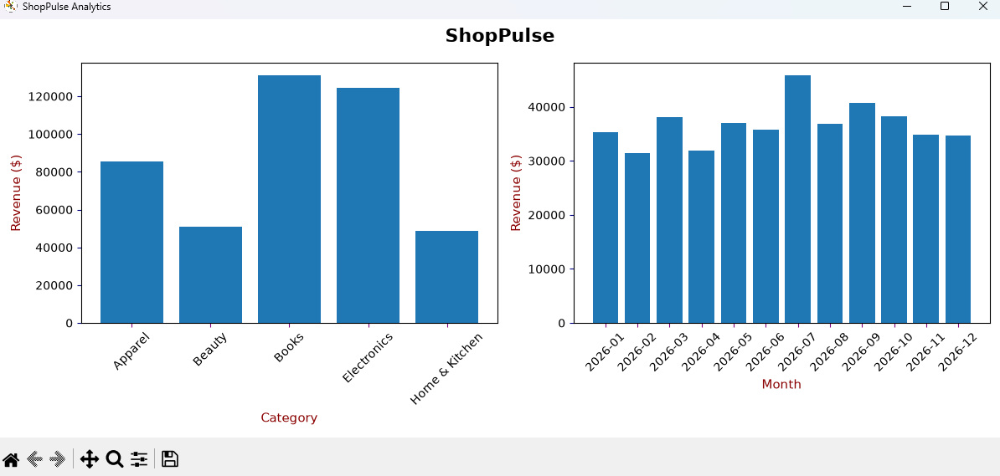

# ShopPulse

ShopPulse is a small Python demo that explores sales analytics using generated transaction data. It creates a sample dataset, calculates sales totals, and displays category and monthly revenue charts.

> This repository currently contains an offline demo script. It does not connect to live stores or provide real-time tracking, inventory alerts, customer analytics, or multi-store management.

## What it does

- Generates 1,000 synthetic transactions dated across 2026.
- Calculates gross sales and sales after discounts.
- Summarizes net sales by product category and month.
- Plots category and monthly totals with Matplotlib.
- Prints total net revenue and the average net sale per generated transaction.

## Requirements

Python 3.11 or newer.

## Install and run

Create and activate a virtual environment:

git clone https://github.com/XAFKTHECODER/ShopPulse.git
cd ShopPulse
python -m venv .venv

# macOS / Linux
source .venv/bin/activate

# Windows PowerShell
# .venv\Scripts\Activate.ps1

pip install -r requirements.txt
python main.py

The script opens a Matplotlib window with the charts, then prints the summary in the terminal. All transactions are generated in memory; no external store or customer data is used.

## Run tests

python -m unittest discover -v

Tests cover sales and discount calculations, monthly/category summaries, and the generated dataset shape.
